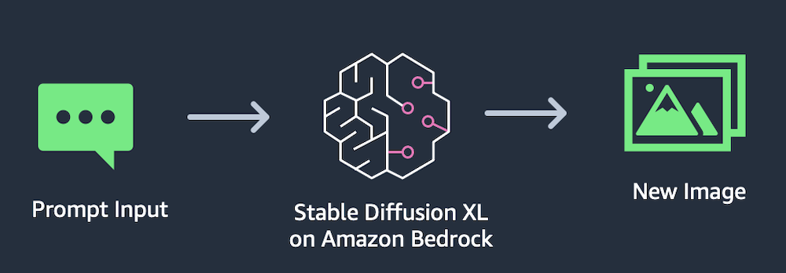
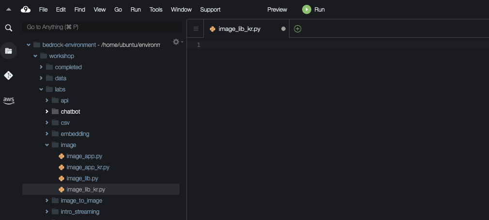
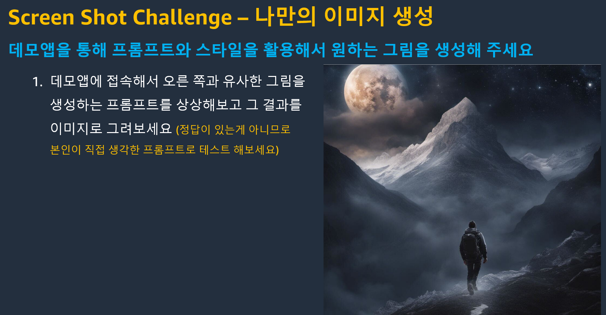

# 실습 1: 이미지 생성 
## 실습 소개
**최종 결과물:**

이 실습에서는 Stable Diffusion, Bedrock, Streamlit을 사용해 기본적인 이미지 생성기를 만들 것 입니다. LangChain은 주로 텍스트 생성 모델을 지원하므로, Boto3 라이브러리를 사용하여 Stable Diffusion과 상호작용 할 것 입니다.
Stable Diffusion은 텍스트 프롬프트에서 이미지를 생성합니다. 무작위 노이즈로 시작하여 일련의 단계에 걸쳐 점차적으로 이미지를 형성합니다. 또한 프롬프트를 기반으로 기존 이미지를 변환하는 데에도 사용할 수 있으며, 이는 이후 실습에서 다루겠습니다.

아래 코드 스니펫을 복사하여 지정된 Python 파일에 붙여넣어 애플리케이션 코드를 빌드할 수 있습니다.

**이 실습을 실행하려면 aws account가 Stable Diffusion을 구독하고 있어야 합니다. Bedrock 콘솔을 통해 구독할 수 있습니다.**

## 사용 사례
- 이미지 생성 패턴은 다음과 같은 사용 사례에 적합합니다:
  - 웹사이트, 이메일 등을 위한 사용자 지정 이미지 생성.
  - 다양한 미디어 형식의 컨셉 아트 제작
 
 

## 아키텍처

이 애플리케이션은 두 개의 파일로 구성되어 있는데, 하나는 Streamlit front-end 용 파일이고 다른 하나는 Bedrock을 호출하기 위한 지원 라이브러리용 파일 입니다.
 
 
 
 

## 라이브러리 스크립트 만들기

먼저 Streamlit front-end와 Bedrock back-end를 연결하기 위한 지원 라이브러리를 생성합니다.

**1. workshop/labs/image 폴더로 이동하여 image_lib_kr.py 파일을 엽니다.**

**2.import 구문을 추가 합니다.**
- 이 구문을 사용하면 Boto3 라이브러리를 사용하여 Bedrock을 호출하고, 환경 변수를 일고, 이미지 데이터를 처리할 수 있습니다.
- 아래 상자의 복사 버튼을 사용하여 코드를 자동으로 복사할 수 있습니다.:
~~~python
import boto3 #AWS SDK 및 지원 라이브러리 가져오기
import json
import base64
from io import BytesIO
~~~

**3. Boto3 클라이언트와 Bedrock model id를 초기화 합니다.**
~~~python
session = boto3.Session() 

bedrock = session.client(service_name='bedrock-runtime')  #베드락 클라이언트를 생성

bedrock_model_id = "stability.stable-diffusion-xl-v1" #Stable Diffusion 모델 사용
~~~
 
**4. 이미지 변환 함수를 추가합니다.**
- 이 함수는 반환된 페이로드에서 이미지 데이터를 추출하여 Streamlit에서 사용할 수 있는 형식으로 변환합니다.
~~~python
def get_response_image_from_payload(response): #모델 응답 페이로드에서 이미지 바이트를 반환합니다

    payload = json.loads(response.get('body').read()) #응답 본문을 json 객체에 로드합니다
    images = payload.get('artifacts') #이미지 아티팩트 추출
    image_data = base64.b64decode(images[0].get('base64')) #이미지 디코딩

    return BytesIO(image_data) #클라이언트 앱 소비를 위한 BytesIO 객체 반환
~~~

**5. 이 함수를 추가하여 Bedrock을 호출합니다.**
- Streamlit front-end 애플리케이션에서 호출할 수 있는 함수를 만들고 있습니다. 이 함수는 입력 콘텐츠를 Bedrock에 전달하고 이미지를 반환합니다.
~~~python
def get_image_response(prompt_content): #text-to-text 클라이언트 함수
    
    request_body = json.dumps({"text_prompts": 
                               [ {"text": prompt_content } ], #사용할 프롬프트
                               "cfg_scale": 9, #모델이 프롬프트와 얼마나 가깝게 일치하려고 하는지
                               "steps": 50, }) ##수행할 Diffusion steps의 수
    
    response = bedrock.invoke_model(body=request_body, modelId=bedrock_model_id) #베드락 엔드포인트를 호출
    
    output = get_response_image_from_payload(response) #응답 페이로드를 클라이언트가 소비할 수 있도록 BytesIO 객체로 변환
    
    return output
~~~

**6. 파일을 저장합니다.**

환상적입니다! 백앤드 라이브러리가 완성되었습니다. 이제 front-end 애플리케이션을 만들어보겠습니다.
 
 
 
 

## Streamlit front-end 앱 만들기
**1. lib 파일과 같은 폴더에서 image_app_kr.py 파일을 엽니다.**

**2. import 구문을 추가 합니다.**
- 이 구문을 사용하면 백킹 라이브러리 스크립트에서 Streamlit 요소를 사용하고 함수를 호출할 수 있습니다.
~~~python
import streamlit as st #모든 streamlit 명령은 "st" 별칭을 통해 사용할 수 있습니다
import image_lib_kr as glib #로컬 라이브러리 스크립트 참조
~~~
 
**3.페이지 제목, 구성 및 열 레이아웃을 추가합니다.**
- 여기서는 실제 페이지의 페이지 제목과 브라우저 탭에 표시되는 제목을 설정하고 있습니다. 왼쪽에 입력을 받고 오른쪽에 출력을 표시하기 위해 두 개의 열을 만들고 있습니다.
~~~python
st.set_page_config(layout="wide", page_title="Image Generation") #컬럼을 위해 페이지 너비를 더 넓게 설정

st.title("Image Generation") #페이지 제목

col1, col2 = st.columns(2) #2개 컬럼 생성
~~~

**4. 입력 요소를 추가합니다.**
- 첫 번쨰 열에는 여러 줄의 텍스트 상자와 버튼을 만들어 사용자의 프롬프트를 가져와서 Bedrock으로 전송합니다.
~~~python
with col1: #이 with 블록의 모든 내용이 컬럼 1에 배치됨
    st.subheader("Image generation prompt") #이 컬럼의 서브헤드
    
    prompt_text = st.text_area("Prompt text", height=200, label_visibility="collapsed") #레이블이 없는 여러 줄 텍스트 상자 표시
    
    process_button = st.button("Run", type="primary") #기본 버튼 표시
~~~

**5. 출력 요소를 추가합니다.**
- 두 번째 열에서는 if 블록을 사용해 버튼 클릭을 처리합니다. 백킹 함수가 호출되는 동안 스피너를 표시한 다음 웹 페이지에 출력을 씁니다.
~~~python
with col2: #이 with 블록의 모든 내용은 컬럼 2에 배치됩니다
    st.subheader("Result") #이 컬럼의 서브헤드
    
    if process_button: #버튼을 클릭하면 이 if 블록의 코드가 실행됩니다
        with st.spinner("Drawing..."): #이 with 블록의 코드가 실행되는 동안 스피너를 표시합니다
            generated_image = glib.get_image_response(prompt_content=prompt_text) #지원 라이브러리를 통해 모델을 호출합니다
        
        st.image(generated_image) #생성된 이미지를 표시합니다
~~~
 
**6. 파일을 저장합니다.**
**훌륭합니다! 이제 애플리케이션을 실행할 준비가 되었습니다!**
 
 
 
 

## Streamlit 앱 실행
**1. AWS Cloud9 혹은 EC2에서 bash terminal을 선택하고 디렉토리를 변경합니다.**
~~~bash
cd ~/environment/workshop/labs/image
~~~
 
**2. 터미널에서 streamlit 명령을 실행합니다.**
~~~bash
streamlit run image_app_kr.py --server.port 8080
~~~
Streamlit 명령에 의해 표시되는 Network URL 및 External URL 링크를 무시합니다. 대신 AWS Cloud9의 프리뷰 기능을 사용하겠습니다.

**3. AWS Cloud9에서 Preview -> Preview Running Application을 선택합니다.**

아래와 같은 웹 페이지가 표시됩니다:
app.png

**4. 몇 가지 프롬프트를 사용해 보고 결과를 확인합니다.**
- A cat and a person, in the style of Picasso
- a beautiful mountain landscape

**5. AWS Cloud9에서 미리보기 탭을 닫습니다.**

**6. 터미널로 돌아가 Control-C 를 눌러 애플리케이션을 종료합니다.**

## 코드 없이 직접 테스트 할수 있게 demo를 미리 준비하였습니다 (아래 데모를 클릭하세요)
[SDXL 이미지 생성 데모](https://bit.ly/my-bedrock)

## 도전과제 

