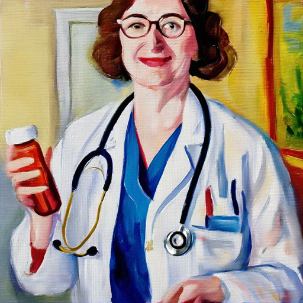
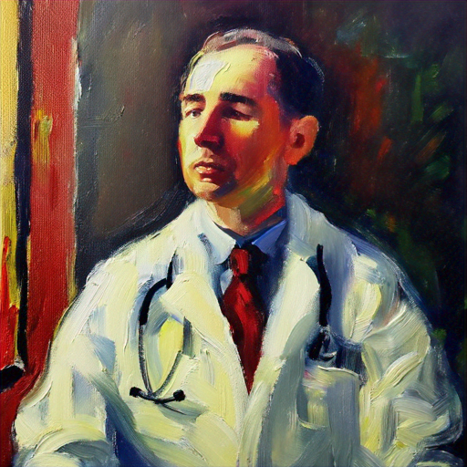
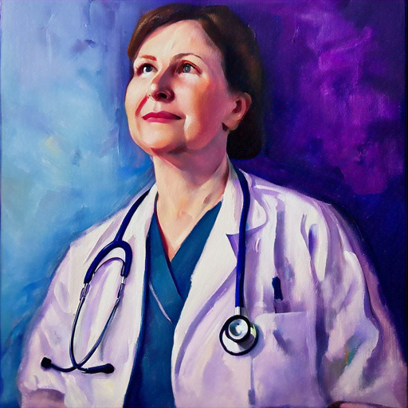
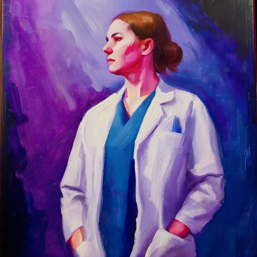

# Lab 2. 이미지 패턴 실습
## (1) 이미지 프롬프팅
실습소개

이 실습에서는 Amazon Titan Image Generator, Amazon Bedrock, Streamlit을 사용하여 기본 이미지 생성기를 구축하겠습니다. LangChain은 주로 텍스트 생성 모델을 지원하므로, Titan Image Generator와 상호 작용하기 위해 Boto3 라이브러리를 사용할 것입니다.

Titan Image Generator는 텍스트 프롬프트에서 이미지를 생성합니다. 무작위 노이즈로 시작하여 일련의 단계에 걸쳐 점차적으로 이미지를 형성합니다. 또한 프롬프트를 기반으로 기존 이미지를 변형하는 데에도 사용할 수 있으며, 이는 나중에 실습에서 시도해 보겠습니다.

아래 코드 스니펫을 복사하여 지정된 Python 파일에 붙여넣으면 애플리케이션 코드를 작성할 수 있습니다.

사용 사례

이미지 생성 패턴은 다음과 같은 사용 사례에 적합합니다:

    웹사이트, 이메일 등을 위한 맞춤형 이미지 제작
    다양한 미디어 형식의 컨셉 아트 제작

이 애플리케이션은 두 개의 파일로 구성됩니다: 하나는 Streamlit 프런트엔드용이고 다른 하나는 Bedrock을 호출하기 위한 지원 라이브러리용입니다.

 
라이브러리 스크립트 만들기

먼저 Streamlit 프론트엔드와 Bedrock 백엔드를 연결하기 위한 지원 라이브러리를 생성합니다.

 

1. AWS Cloud9에서 workshop/labs/image_prompts 폴더로 이동하여 image_prompts_lib_kr.py 파일을 엽니다.

2.import 구문을 추가합니다.
- 이 명령문을 통해 LangChain을 사용하여 FAISS 데이터베이스를 관리하고 Boto3를 사용하여 Bedrock을 호출 할 수 있습니다.
- 아래 상자의 복사 버튼을 사용하면 해당 코드를 자동으로 복사할 수 있습니다:
~~~python
import os
import boto3
import json
import base64
from io import BytesIO
from random import randint
~~~

3. Request body 빌더 함수를 추가합니다.
- 이 함수는 Bedrock에 제출할 요청 페이로드를 준비합니다:
~~~python
#InvokeModel API 호출에 대한 문자열화된 리퀘스트 바디를 가져옵니다.
def get_titan_image_generation_request_body(prompt, negative_prompt=None):
    
    body = { #InvokeModel API에 전달할 JSON 페이로드를 생성합니다.
        "taskType": "TEXT_IMAGE",
        "textToImageParams": {
            "text": prompt,
        },
        "imageGenerationConfig": {
            "numberOfImages": 1,  # 생성할 이미지 개수
            "quality": "premium",
            "height": 512,
            "width": 512,
            "cfgScale": 8.0,
            "seed": randint(0, 100000),  # 랜덤 시드 사용
        },
    }
    
    if negative_prompt:
        body['textToImageParams']['negativeText'] = negative_prompt
    
    return json.dumps(body)
~~~

4. 이미지 변환 기능을 추가합니다.
- 이 함수는 반환된 페이로드에서 이미지 데이터를 추출하여 Streamlit에서 사용할 수 있는 형식으로 변환합니다.
~~~python
#Titan Image Generator 응답에서 BytesIO 객체를 가져옵니다.
def get_titan_response_image(response):

    response = json.loads(response.get('body').read())
    
    images = response.get('images')
    
    image_data = base64.b64decode(images[0])

    return BytesIO(image_data)
~~~

5. 이 함수를 추가하여 Bedrock을 호출합니다.
- Streamlit 프론트엔드 애플리케이션에서 호출할 수 있는 함수를 만들고 있습니다. 이 함수는 입력 콘텐츠를 Bedrock에 전달하고 이미지를 반환합니다.
~~~python
#Amazon Titan Image Generator를 사용하여 이미지 생성
def get_image_from_model(prompt_content, negative_prompt=None):
    session = boto3.Session(
        profile_name=os.environ.get("BWB_PROFILE_NAME")
    ) #AWS 자격 증명에 사용할 프로필 이름 설정
    
    bedrock = session.client(
        service_name='bedrock-runtime', #Bedrock 클라이언트를 생성
        region_name=os.environ.get("BWB_REGION_NAME"),
        endpoint_url=os.environ.get("BWB_ENDPOINT_URL")
    ) 
    
    body = get_titan_image_generation_request_body(prompt_content, negative_prompt=negative_prompt)
    
    response = bedrock.invoke_model(body=body, modelId="amazon.titan-image-generator-v1", contentType="application/json", accept="application/json")
    
    output = get_titan_response_image(response)
    
    return output
~~~

6.파일을 저장합니다.
환상적입니다! 백킹 라이브러리가 완성되었습니다. 이제 프론트엔드 애플리케이션을 만들어 보겠습니다.

7. 몇 가지 프롬프트를 시도해보고 결과를 확인하세요.
- daguerreotype of robot and cowboy standing side-by-side, directly facing the camera, steampunk, western town in the background, long shot, sepia tone
- photograph of a calico cat, cyberpunk, futuristic cityscape in the background, low angle, long shot, neon sign on building "CALICO CORP", Epic, photorealistic, 4K

8. 다양한 요소를 사용하여 작성된 몇 가지 예시 프롬프트는 아래 표를 참조하세요.

|Element added|Prompt|Image|Note|
|------|---|---|---|
|Subject|Doctor||일반적으로 사진과 같은 이미지로 기본 설정됩니다.|
|Medium|Painting of a doctor||생성할 아트 유형 (기타 예: 다게레오타입, 연필 스케치, 수채화, 3D 만화 등)|
|Style|Painting of a doctor, Impressionist style||생성할 예술의 스타일 또는 테마(기타 예: 다다이스트 스타일, 르네상스 스타일 등)|
|Shot type/angle|Painting of a doctor, Impressionist style, low-angle shot||이미지의 각도 또는 거리(기타 예: 와이드 샷, 클로즈업 등)|
|Light|Painting of a doctor, Impressionist style, low-angle shot, dim lighting||이미지의 조명 구성표(기타 예: 골든 아워, 스튜디오 조명 등)|
|Color scheme|Painting of a doctor, Impressionist style, low-angle shot, dim lighting, blue and purple color scheme||이미지의 색 구성표(기타 예: 파스텔 색상, 네온 색상, 그레이 스케일 등)|
|Negative prompt|(Use the What shoud not be in the image field) Stethoscope||이미지에 포함하지 말아야 할 항목|
|Text|Painting of a doctor, Impressionist style, low-angle shot, dim lighting, blue and purple color scheme, sign reading "The Doctor is in"||Titan Image Generator의 경우 텍스트는 큰따옴표로 묶어야 합니다. 생성된 이미지에 오타가 있을 수 있습니다.|
