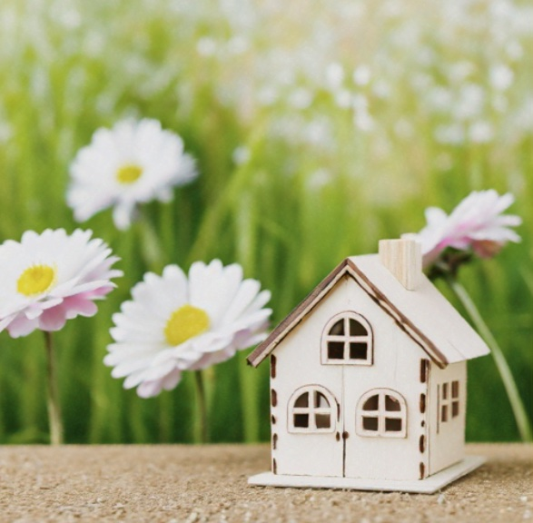
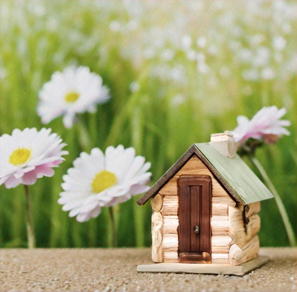
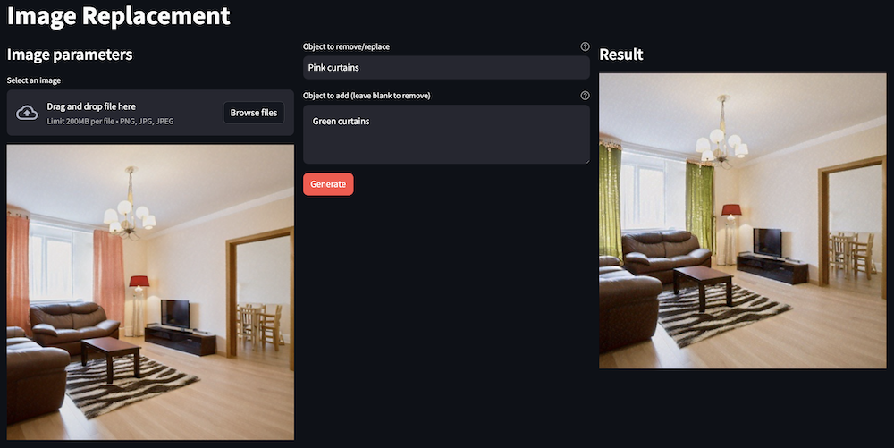
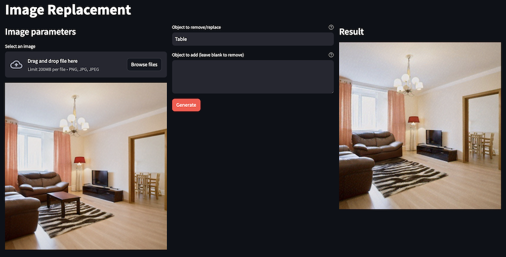

# 실습 3. Advanced Pattern
## (1) 객체를 변경 또는 제거
## 실습소개

이 실습에서는 Amazon Titan Image Generator, Amazon Bedrock 및 Streamlit을 사용하여 이미지 객체 변경 애플리케이션을 구축합니다. Titan Image Generator와 상호 작용하기 위해 Boto3 라이브러리를 사용할 것입니다.
Titan Image Generator는 mask prompting을 지원합니다. 이를 통해 정확한 치수를 몰라도 이미지에서 제거할 항목을 지정할 수 있습니다. Titan Image Generator는 지정된 항목을 자동으로 마스킹하여 그 자리에 다른 항목을 삽입할 수 있도록 합니다.
아래 그림을 참조하여 단계를 알아보세요:

|1. 원본 이미지로 시작|2. 마스킹할 객체 지정|3. 마스킹된 영역에 무엇을 칠할지 지정합니다.|4. 원본 이미지의 마스크된 영역에 인페인팅|
|------|---|---|---|
| |"Toy house"|"Log cabin"||

    
## 사용 사례
객체 변경 또는 제거 패턴은 다음과 같은 사용 사례에 적합합니다:
- 차량 사진에서 사람 제거하기
- 집 사진에서 잡동사니 제거하기
- 가구나 장식품을 비슷한 크기의 아이템으로 교체하기
이 애플리케이션은 두 개의 파일로 구성되어 있는데, 하나는 Streamlit 프런트엔드용 파일이고 다른 하나는 Bedrock을 호출하기 위한 지원 라이브러리용 파일입니다.

    
## 라이브러리 스크립트 만들기
먼저 Streamlit 프론트엔드와 Bedrock 백엔드를 연결하기 위한 지원 라이브러리를 생성합니다.

**1. AWS Cloud9에서 workshop/labs/image_replacement 폴더로 이동하여 image_replacement_lib_kr.py 파일을 엽니다.**

**2. 이미지 생성을 위한 라이브러리 코드를 구성합니다.**
~~~python
import os
import boto3
import json
import base64
from io import BytesIO
from random import randint

#파일 바이트에서 BytesIO 객체 가져오기
def get_bytesio_from_bytes(image_bytes):
    image_io = BytesIO(image_bytes)
    return image_io

#파일 바이트에서 base64로 인코딩된 문자열 가져오기
def get_base64_from_bytes(image_bytes):
    resized_io = get_bytesio_from_bytes(image_bytes)
    img_str = base64.b64encode(resized_io.getvalue()).decode("utf-8")
    return img_str

#디스크의 파일에서 바이트 로드
def get_bytes_from_file(file_path):
    with open(file_path, "rb") as image_file:
        file_bytes = image_file.read()
    return file_bytes

#InvokeModel API 호출에 대한 문자열화된 리퀘스트 바디를 가져옵니다.
def get_titan_image_inpainting_request_body(prompt, image_bytes=None, mask_prompt=None, negative_prompt=None):
    input_image_base64 = get_base64_from_bytes(image_bytes)
    
    body = { #InvokeModel API에 전달할 JSON 페이로드를 생성합니다.
        "taskType": "INPAINTING",
        "inPaintingParams": {
            "image": input_image_base64,
            "maskPrompt": mask_prompt,
        },
        "imageGenerationConfig": {
            "numberOfImages": 1,  # 생성할 변형 개수
            "quality": "premium",  # 허용되는 값은 " standard" 또는 "premium"입니다.
            "height": 512,
            "width": 512,
            "cfgScale": 8.0,
            "seed": randint(0, 100000),  # 랜덤 시드 사용
        },
    }
    
    if prompt:  #마스킹된 항목이 있던 위치에 삽입할 항목을 표시합니다(항목을 제거하려면 비워둡니다).
        body['inPaintingParams']['text'] = prompt #프롬프트가 없는 경우 마스크 프롬프트에 표시된 항목만 제거합니다.
    
    return json.dumps(body)

#Titan Image Generator 응답에서 BytesIO 객체를 가져옵니다.
def get_titan_response_image(response):

    response = json.loads(response.get('body').read())
    
    images = response.get('images')
    
    image_data = base64.b64decode(images[0])

    return BytesIO(image_data)

#Amazon Titan Image Generator를 사용하여 이미지 생성
def get_image_from_model(prompt_content, image_bytes, mask_prompt=None):
    session = boto3.Session(
        profile_name=os.environ.get("BWB_PROFILE_NAME")
    ) #AWS 자격 증명에 사용할 프로필 이름 설정
    
    bedrock = session.client(
        service_name='bedrock-runtime', #Bedrock 클라이언트를 생성
        region_name=os.environ.get("BWB_REGION_NAME"),
        endpoint_url=os.environ.get("BWB_ENDPOINT_URL")
    ) 
    
    body = get_titan_image_inpainting_request_body(prompt_content, image_bytes, mask_prompt=mask_prompt)
    
    response = bedrock.invoke_model(body=body, modelId="amazon.titan-image-generator-v1", contentType="application/json", accept="application/json")
    
    output = get_titan_response_image(response)
    
    return output
~~~

**3. streamlit app을 만듭니다.**
~~~python
import streamlit as st
import image_replacement_lib_kr as glib

st.set_page_config(layout="wide", page_title="Image Replacement")

st.title("Image Replacement")

col1, col2, col3 = st.columns(3)

with col1:
    st.subheader("Image parameters")
    
    uploaded_file = st.file_uploader("Select an image", type=['png', 'jpg'])
    
    if uploaded_file:
        uploaded_image_preview = glib.get_bytesio_from_bytes(uploaded_file.getvalue())
        st.image(uploaded_image_preview)
    else:
        st.image("images/example.png")
    
    
with col2:
    mask_prompt = st.text_input("Object to remove/replace", value="Pink curtains", help="The mask text")
    
    prompt_text = st.text_area("Object to add (leave blank to remove)", value="Green curtains", height=100, help="The prompt text")
    
    generate_button = st.button("Generate", type="primary")
    
    
with col3:
    st.subheader("Result")

    if generate_button:
        with st.spinner("Drawing..."):
            
            if uploaded_file:
                image_bytes = uploaded_file.getvalue()
            else:
                image_bytes = glib.get_bytes_from_file("images/example.png")
            
            generated_image = glib.get_image_from_model(
                prompt_content=prompt_text, 
                image_bytes=image_bytes, 
                mask_prompt=mask_prompt,
            )
        
        st.image(generated_image)
~~~

**4. streamlit app 실행**
~~~
cd ~/environment/workshop/labs/image_replacement
streamlit run image_replacement_app_kr.py --server.port 8501 --server.enableXsrfProtection=false
~~~

    
## 코드 없이 직접 테스트 할수 있게 demo를 미리 준비하였습니다 (아래 데모를 클릭하세요)
<a href="https://bit.ly/my-bedrock" target="_blank"> **https://bit.ly/my-bedrock** </a>

    
**5. Generate 버튼을 클릭하여 미리 로드된 이미지에서 커튼 부분을 교체합니다.**

**6. 이번에는 미리 로드된 이미지에서 항목을 제거해 보세요.**
- 항목을 제거하려면, **Object to add (제거하려면 비워 둡니다)**라고 표시된 필드에서 텍스트를 삭제 합니다.
- lamp 혹은 table 을 제거해 보세요.

**7. 선택 사항으로 256x256에서 1024x1024 사이의 크기와 인치당 72픽셀의 해상도를 가진 이미지를 업로드합니다.**

**8. 대체할 개체와 대체할 내용을 설정해야 합니다. Generate 버튼을 클릭하여 결과를 확인합니다.**

    
## (2) 이미지 생성 모델의 다양한 활용
- [이미지 검색](https://catalog.us-east-1.prod.workshops.aws/workshops/10435111-3e2e-48bb-acb4-0b5111d7638e/ko-KR/image-labs/bedrock-image-search)
- [아웃페인팅](https://catalog.us-east-1.prod.workshops.aws/workshops/10435111-3e2e-48bb-acb4-0b5111d7638e/ko-KR/image-labs/bedrock-image-extension)
- [이미지이해](https://catalog.us-east-1.prod.workshops.aws/workshops/10435111-3e2e-48bb-acb4-0b5111d7638e/ko-KR/image-labs/bedrock-image-understanding)

## Advanced 도전과제
- [멀티모달 챗봇](https://catalog.us-east-1.prod.workshops.aws/workshops/10435111-3e2e-48bb-acb4-0b5111d7638e/ko-KR/image-labs/bedrock-multimodal-chatbot)
    
## (3) 이미지 스타일
## 아래 demo app의 최종본의 Lab3. Stylechange를 선택해서 이미지 스타일을 적용해보세요
<a href="https://bit.ly/my-bedrock" target="_blank"> **https://bit.ly/my-bedrock** </a>

다음의 프롬프트를 작성하고 style을 적용해보세요.
- daguerreotype of robot and cowboy standing side-by-side, directly facing the camera, steampunk, western town in the background, long shot, sepia tone
- photograph of a calico cat, cyberpunk, futuristic cityscape in the background, low angle, long shot, neon sign on building "CALICO CORP", Epic, photorealistic, 4K
    

## 도전과제 

