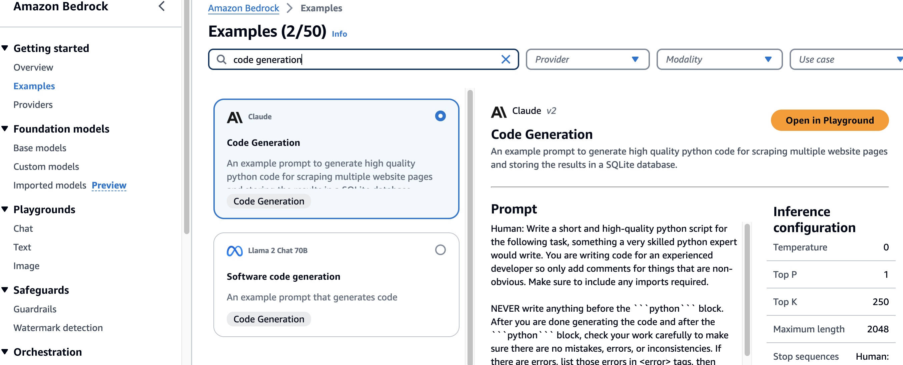
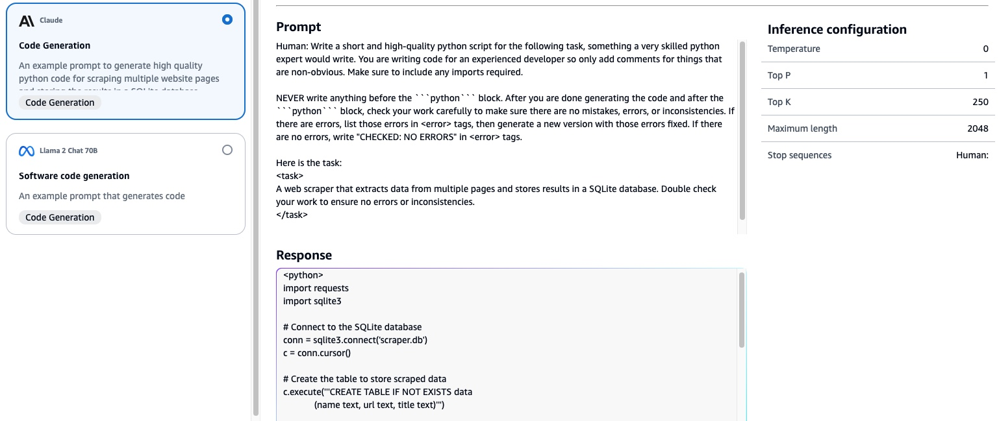
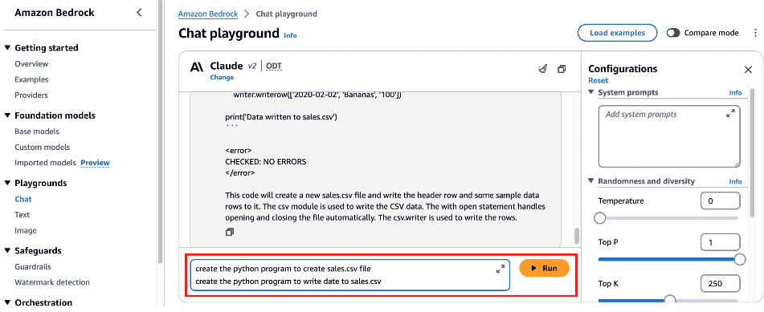
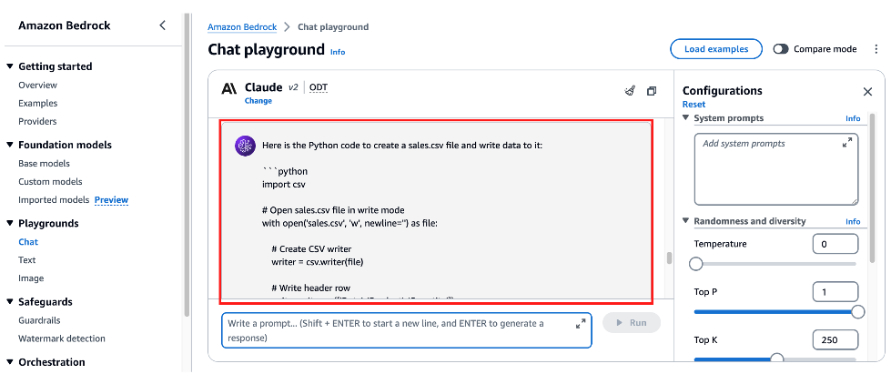

# 실습 1: Bedrock CodeGeneration
## 실습 소개
이 실습에서는 Amazon Bedrock 에서 CodeGeneration을 위한 Claude v2 모델을 활용하여, Code Generation을 실습해봅니다.
 

* 이 실습을 실행하려면 aws account가 Claude v2을 구독하고 있어야 합니다. Bedrock 콘솔을 통해 구독할 수 있습니다.
 
 
 

## Bedrock PlayGround에서 코드 생성 실습하기
#### 1. Amazon Bedrock 콘솔 > Example에서 'Code Generation'을  검색하여, Claude v2를 선택합니다.

Promt와 Response의 예제를 확인하고 내가 찾던 모델인지 확인해봅니다.

실습을 위해 'Open in Playground'를 클릭하여 실습 환경을 생성합니다.
 
 
 

## Text2Python
**1. 다음과 같이 Single-line 코드 생성을 실습해봅니다.**

~~~
create the python program to create sales.csv file
create the python program to write date to sales.csv
~~~

 
Bedrock의 답변을 확인해봅니다.
 

이와 같은 방법으로 여러가지 코드 생성을 테스트 해보겠습니다.
 
 

**2. 다음과 같이 Full function 코드 생성을 실습해봅니다.** 

- 버그가 없을 것, 표준 라이브라리를 쓸 것 등에 대한 요청사항을 추가해봅니다.
~~~
You have a CSV, sales.csv, with columns:
- date (YYYY-MM-DD)
- product_id
- price
- units_sold
Create a python program to analyze the sales data from a CSV file. The program should be able to read the data, and determine below:
- Total revenue for the year
- The product with the highest revenue
- The date with the highest revenue
- Visualize monthly sales using a bar chart
Ensure the code is syntactically correct, bug-free, optimized, not span multiple lines unnessarily, and prefer to use standard libraries. Return only python code without any surrounding text, explanation or context.
~~~
 
 
 

## 연습 코딩
이번 연습코딩에서는 프롬프트 예시를 드리지 않습니다. 직접 Bedrock Claude에게 코딩을 해달라고 한글로 요청해봅시다.

**1. 검색 포털 naver.com에서  '뉴진스'의 기사를 검색하고 기사 제목과 링크 정보를 출력하는 파이썬 어플리케이션을 만들어달라고 해보세요.**
 
 

**2. 내가 우리 부서의 파트장이라고 가정했을 때, 우리부서에서 연봉 1위가 누구인지와, 그 연봉이 얼마인지를 조회하는 쿼리를 만들어봅시다.**
 
 

**3. 내 고등학교 성적이 수학은 전교 1등이었는데 영어 성적은 1등이 아니었을 때가 몇학년인지 조회하는 쿼리를 만들어달라고 해보세요.**
 
 

**4. 엔비디아의 주가가 떨어질때마다 내게 이메일을 보내주는 프로그램을 개발해달라고 해봅시다.**
