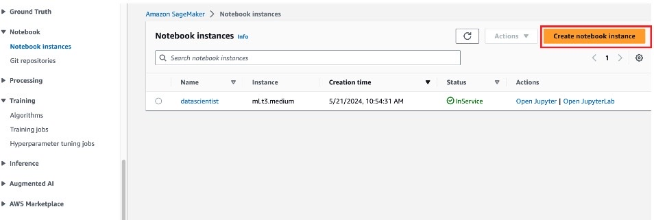
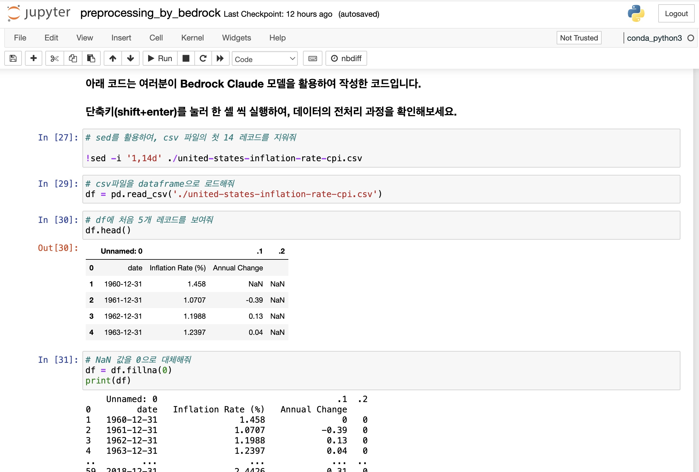

# 실습 3: Bedrock으로 Data Scientist가 되어보자
## 실습 소개
이 실습에서는 Amazon Bedrock 을 통해 만든 python code로
직접 DataScientist가 되어 SageMaker Jupyter에서 데이터 전처리 작업을 해봅니다.

이번 실습에서도 마찬가지로 Claude v2 모델을 사용합니다.

이번 실습에서 전처리를 할 데이터는 미국 인플레이션 파일(united-states-inflation-rate-cpi.csv)입니다.</br>
데이터는 전반적으로 아래와 같은 형태입니다. 이대로는 분석을 진행하기에 데이터가 적합하지 않습니다. 이를 위해 데이터 분석을 위한 첫번째 과정인 Data Pre Processing(전처리) 작업을 해볼 것입니다.</br>Python경험이 없어도 괜찮습니다. Bedrock Playground에서 Claude에게 물어보면 됩니다.


</br>
</br>

**1. sed는 streamlined editor로 문자열/파일을 수정(치환, 삭제, 삽입 등) 하여 출력해주는 기능을 제공합니다.<br/>
이를 활용하여, united-states-inflation-rate-cpi.csv(출처: https://www.macrotrends.net/global-metrics/countries/USA/united-states/inflation-rate-cpi) 파일의 첫 14 레코드를 지우는 방법을 물어보겠습니다.**

~~~python
jupyter 에서 sed를 활용하여, ./united-states-inflation-rate-cpi.csv 파일의 첫 14 레코드를 지우고 싶어
~~~
</br>
</br>

**2. data frame(데이터 프레임) 이란 파이썬에서 데이터 분석 시 사용하는 #데이터 구조# 객체입니다. 열은 각각의 변수를, 행은 각각의 관측치를 나타냅니다. 
이는 열과 행으로 이루어진 데이터 구조로, 우리가 흔히 아는 DB 테이블과 동일하다고 생각하시면 됩니다.이를 생성하기 위해서는 pandas 라이브러리를 사용할 수 있습니다. 일반적으로 데이터 분석 작업 시, raw 데이터를 data frame 구조로 변환하여 데이터를 핸들링하게 됩니다. 우리가 전처리중인 csv 파일을 data frame형태로 변환해달라고 Bedrock에게 질문해 보겠습니다.**

```
 ./united-states-inflation-rate-cpi.csv파일을 dataframe으로 로드해줘
```
어떤 라이브러리를 import해야하는 지 부터해서 코드를 생성하고 각 메서드에 대해 해석합니다. 

<br/> 
<br/> 

3. df에 데이터가 제대로 들어갔는지 확인하는 방법을 Bedrock에게 질문해 보겠습니다.
```
df에 처음 5개 레코드를 보여줘 
```
<br/> 
<br/> 

4) 전처리 되지 않은 데이터에 NaN 값이 있을 수 있어, 이 값을 0으로 변환시키는 방법을 Bedrock에게 질문해 보겠습니다.
```
NaN 값을 0으로 대체해줘
```
<br/> 
<br/> 

5) 해당 data frame을 좀더 활용하기 좋게, data frame에 열 이름을 지정하는 법을 질문해 보겠습니다.
```
df의 레코드 첫 행을 열 이름으로 사용해줘
```
<br/> 
<br/> 

6) df에 열 이름이 생기면서, 데이터와 중복되는 부분이 있을테니 이를 지우는 법을 물어보겠습니다.
```
 df에서 첫 행은 지워줘
```
<br/> 
<br/> 

7) df의 대략적인 통계정보가 궁금해져서 이를 확인하는 방법을 물어보겠습니다.
```
df 데이터에 대해 요약해줘
```
<br/> 
<br/> 

8) 이제는 문자열로 되어있는 Inflation Rate (%) 열을 숫자타입으로 변경해달라고 해보겠습니다.
```
 Inflation Rate (%) 열의 type을 numeric으로 설정해줘
```
<br/> 
<br/> 

9) 이제는 data frame의 데이터를 가지고 그래프를 만들어 달라고 요청해보겠습니다.
```
df 데이터 기반으로 시간에 따른 변화율을 보여주는 차트를 만들어줘
```
<br/> 
<br/> 

10)  Annual Change의 숫자값들을 그래프에 활용할 수 있도록 타입변경을 해달라고 해보겠습니다.
```
 Annual Change 열을 numeric으로 설정해줘
```
<br/> 
<br/> 

11. 이제는 조금 더 그래프에 다양한 옵션을 다는 방법을 질문해 보겠습니다.
```
인플레이션 비율과 연관 변화율을 시간에 따라 보여주는 차트를 show 해줘. 그리고 타이틀도 달아주고, 레이블과 제목도 추가해줘
```
<br/> 
<br/> 

12. 전처리를 마치고 df로 전환된 데이터를 다시 활용할 수 있도록 csv 파일로 저장해달라고 해보겠습니다.
```
이 df 를 inflation_rate_updated 라는 이름의 csv파일로 저장해줘
```
<br/> 
<br/> 

이 파일을 향후 다른 서비스에서도 이용할 수 있게 나의 S3 버켓에 복제해달라고 해보겠습니다.
<br/> 아래로 접속하시면 여러분의 S3 버켓명을 확인하실 수 있습니다. 아래 prompt의 버켓명을 나의 버켓명으로 대체합니다.
<br/> https://us-west-2.console.aws.amazon.com/s3/buckets?region=us-west-2
<br/>

```
새로운 csv 파일을 S3 버켓 genai-workshop-studio-s3bucket-xxxxxxxxxxx 에 복사해줘
```


<br/>
<br/>

## SageMaker Jupyter Notebook에서 코드 실행해보기

본 Bedrock 을 통해 생성한 Code들을 옮겨서, Jupyter notebook에서 실행가능한 ipnyb 파일로 미리 생성해 두었습니다.
<br/> Bedrock이 알려준 코드로, 실제 데이터 전처리 작업이 가능한지 실습 해 보겠습니다.

Download here: (다운로드 링크 추가 예정)

콘솔에서 SageMaker 메뉴에 접속합니다
바로가기: https://us-west-2.console.aws.amazon.com/sagemaker/home?region=us-west-2#/getting-started

좌측 패널 메뉴의 Notebook > Notebook instances > 'Create notebook instance' 버튼을 클릭합니다.


<br/>

노트북 인스턴스명을 지정하고,(예제에서는 datascientist로 지정하였습니다)
<br>나머지 옵션은 그대로 두고, IAM Role도 기존에 생성되어있는 Role로 선택합니다(Use existing role).


인스턴스 상태(Status)가 InService 일 때, 'Open Jupyter'를 눌러 노트북 인스턴스를 실행시킵니다. 


Uploade를 눌러 다운로드 경로에서 preprocessing_by_bedrock.ipynb 파일을 찾아 노트북 인스턴스에 업로드 하고, 업로드된 파일을 더블클릭하여  실행시킵니다. 


Jupyter Notebook 단축키(shift + enter)를 눌러서 
각 셀들이 실행되는 과정을 확인합니다. 
<br>


전처리한 파일이 노트북 인스턴스 로컬에 저장됩니다.

[이미지 추가 예정]


전처리한 파일이 S3 버켓에 저장됩니다. 
[이미지 추가 예정]


## Demo. Amazon Q Developer를 활용한 Code Generation
